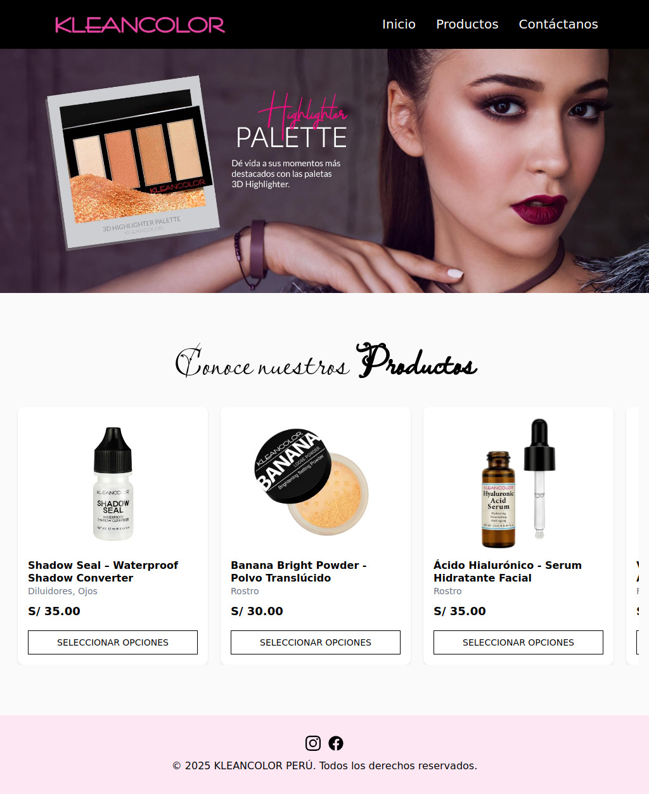

# 🛍️ Ecommerce KleanColor

Bienvenido/a a **Ecommerce KleanColor**, una tienda en línea moderna y responsiva construida con React, Vite y TailwindCSS. Inspirada en la estética de KleanColor, esta app simula una experiencia real de compra de productos de belleza.

---

## 🚀 Demo en vivo

👉 [Ver sitio desplegado en Vercel](https://ecommerce-kleancolor-wkn4.vercel.app)

---

## 🧠 Funcionalidades

- ✅ Vista de catálogo con productos filtrados por categoría
- ✅ Página de detalle por producto
- ✅ Sistema de galería de imágenes por producto con selección de colores
- ✅ Enlace a contacto para pedidos personalizados
- ✅ Diseño responsivo (desktop/tablet/mobile)
- ✅ Implementación de rutas dinámicas con React Router (slug por producto)
- ✅ Despliegue en Vercel

---

## 🛠️ Tecnologías utilizadas

- ⚛️ React
- ⚡ Vite
- 🎨 TailwindCSS
- 🗂️ React Router
- 🧑‍💻 Vercel (Deploy)
- 📁 Estructura modular por componentes

---

## 📷 Capturas

| Home Page                       | Página de Producto                     | Responsive                          |
| ------------------------------- | -------------------------------------- | ----------------------------------- |
|  |  |  |

---

## 📦 Instalación local

```bash
git clone https://github.com/JCesarAguilar/Ecommerce-Kleancolor.git
cd front
npm install
npm run dev
```
